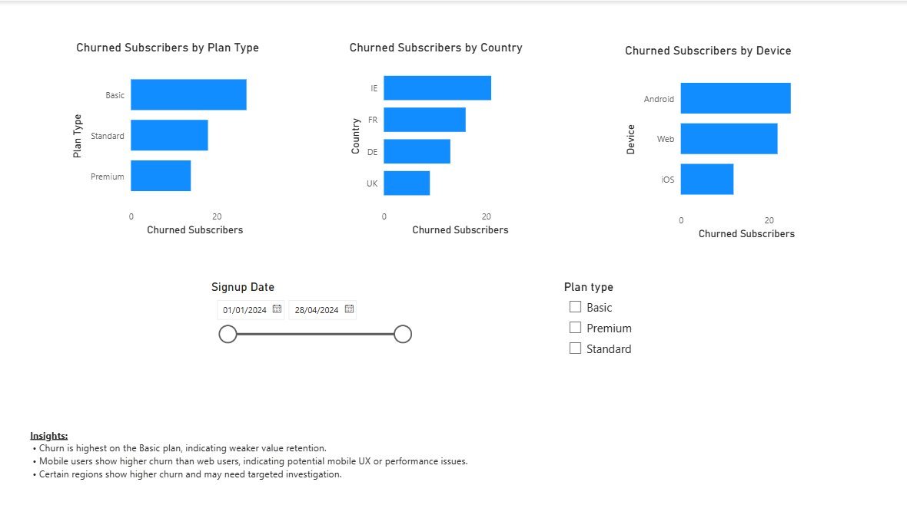
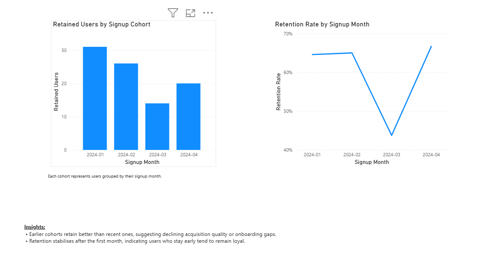
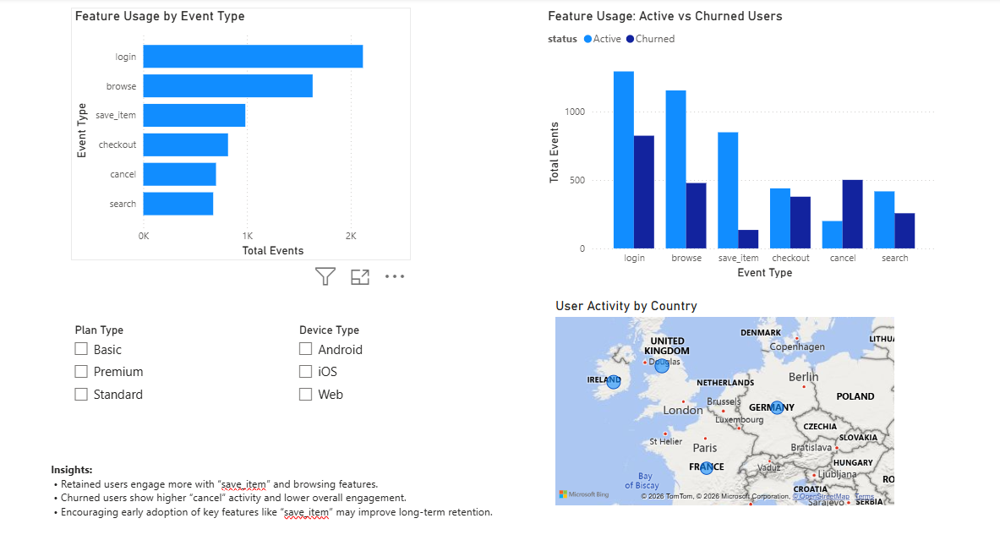

# Subscription Product Analytics Dashboard (Power BI)

This project is a portfolio dashboard that analyses subscription performance for a digital product.  
It focuses on business and product questions such as churn, retention, cohort behaviour, and feature usage patterns.

## What this dashboard answers
- How are subscribers and revenue trending over time?
- Which segments (plan, device, country) churn the most?
- How does retention vary by signup cohort?
- What user behaviours are associated with retention vs churn?

## Pages (high level)
1. **Executive Overview** - Active subscribers, churn rate, MRR trend  
2. **Retention & Churn Analysis** - Churn breakdown by plan, device, and country  
3. **Retention & Cohort Analysis** - Retention by signup month and retention rate  
4. **Feature Usage & Retention Drivers** - Behavioural patterns (events) for active vs churned users + geographic view

## Key insights (example)
- Churn is highest on the **Basic** plan, suggesting lower perceived value versus Standard/Premium.
- **Mobile** users show higher churn than web users, indicating potential UX or performance issues.
- Retained users engage more with high-intent actions such as **save_item**, while churned users show higher **cancel** activity.

## Data
The dataset used is **synthetic** (created for portfolio purposes) and includes:
- `subscription_users.csv` (user attributes: signup date, country, device, plan)
- `subscriptions.csv` (subscription status, start/end dates, monthly price)
- `subscription_events.csv` (user behaviour events such as login, browse, save_item, cancel)

## Tools
- Power BI Desktop (data modelling, DAX measures, visual design)
- DAX (KPIs: churn rate, retention rate, MRR)
- SQL concepts for data validation and metric logic

## Repo contents
- `assets/` - dashboard screenshots and optional PDF export
- `data/` - synthetic dataset used for analysis
- `pbix/` - Power BI report file (if included)
- `measures.md` - key DAX measures used in the report

## Screenshots
### Executive Overview

### Retention & Churn Analysis

### Retention & Cohort Analysis

### Feature Usage & Retention Drivers

