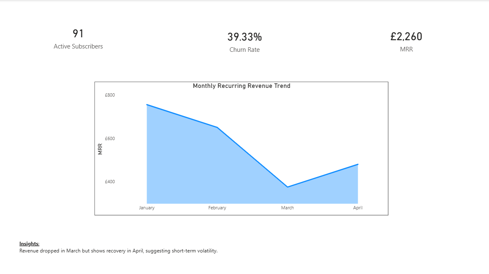
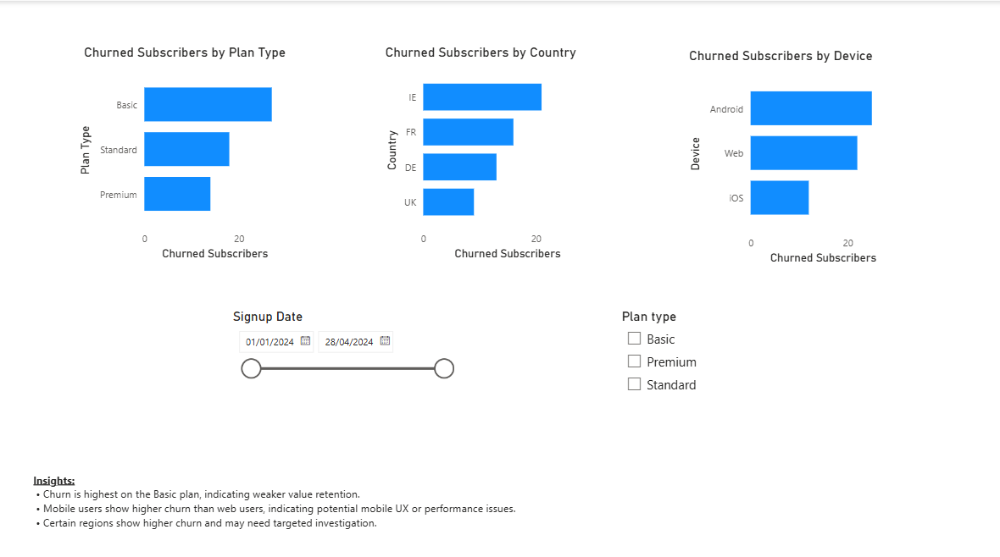
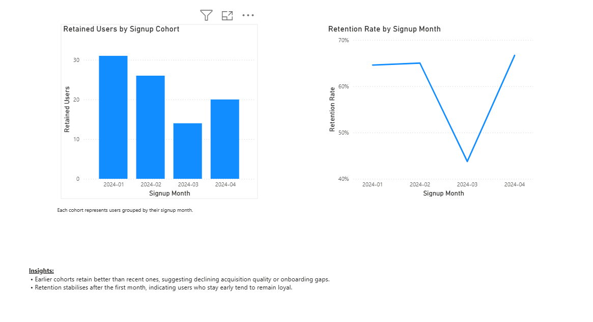
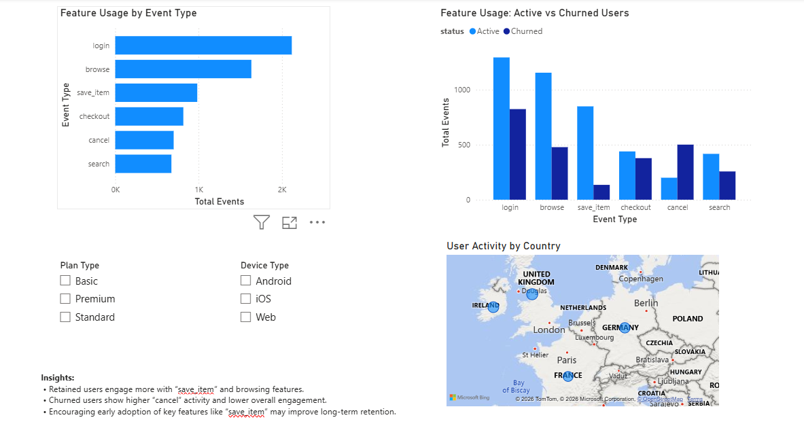

# Subscription Analytics Project (Power BI)

## Business Context

This project simulates a subscription-based digital product (e.g. streaming or SaaS platform) aiming to improve customer retention and revenue performance.

The business is experiencing rising churn and limited visibility into user behaviour across the subscription lifecycle. Stakeholders require a clear understanding of retention patterns, revenue drivers, and behavioural signals to inform product improvements and pricing strategy.

As part of this analysis, the objective is to define key metrics, structure analytical datasets, and generate actionable insights to support data-driven decision-making.

## Problem Statement
- Why are users churning?
- Which customer segments are at highest risk?
- What behavioural patterns differentiate retained vs churned users?
- How can retention and revenue (MRR) be improved?

## Analytical Objectives

- Define churn, retention rate, and MRR using consistent metric logic
- Analyse subscriber and revenue trends over time
- Evaluate retention by signup cohort
- Identify behavioural patterns associated with churn vs retention
- Segment churn risk by plan, device, and geography

## Data Modelling Approach

- Built a relational data model across user, subscription, and event datasets
- Created calculated DAX measures for churn rate, retention rate, and MRR
- Structured analysis to correlate behavioural events with subscription outcomes
- Validated metric logic through controlled filtering and cohort testing

## Key Insights

- Churn is highest on the **Basic** plan, suggesting potential pricing or value perception differences versus Standard/Premium tiers.
- **Mobile users** exhibit higher churn compared to web users, indicating potential UX or performance friction.
- Retained users demonstrate stronger engagement with high-intent actions such as **save_item**, while churned users show increased **cancel** activity prior to exit.

## Dataset

The dataset used is synthetic (created for portfolio purposes) and includes:

- `subscription_users.csv` — user attributes (signup date, country, device, plan)
- `subscriptions.csv` — subscription lifecycle data (status, start/end dates, monthly price)
- `subscription_events.csv` — behavioural event data (login, browse, save_item, cancel)

## Tools & Techniques

- Power BI Desktop (data modelling and analysis)
- DAX for KPI calculation (churn rate, retention rate, MRR)
- SQL-based metric logic and validation principles

## Repository Contents

- `assets/` — dashboard screenshots and optional PDF export
- `data/` — synthetic datasets used for analysis
- `measures.md` — documentation of key DAX measures

---

### Executive Overview

### Retention & Churn Analysis

### Retention & Cohort Analysis

### Feature Usage & Retention Drivers

